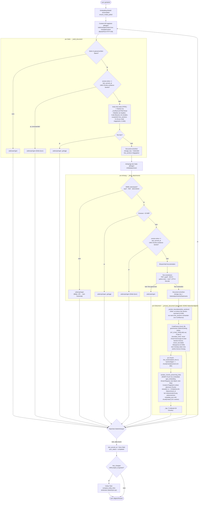

# Confluence-Sync-Pipeline (`ConfluenceConnector`)

Ablauf von `BaseConnector.sync()` (`parser/connectors/base.py`) mit
`ConfluenceConnector.fetch_documents()` (`parser/connectors/confluence.py`) —
im Unterschied zur COBOL-Strukturanalyse bei Git (siehe
`docs/GIT_SYNC_PIPELINE.md`) rein textbasiert: Seiten kommen als gerendertes
HTML, Chunking läuft ausschließlich generisch.

## Kernpunkte

- **Keine Nebenläufigkeit:** anders als `GitConnector` (Semaphore-gesteuerte
  Parallelverarbeitung, siehe `docs/GIT_SYNC_PIPELINE.md`) verarbeitet
  `BaseConnector.sync()` — und damit Confluence, Jira, WebDAV, FolderWatch —
  Dokumente strikt **sequentiell**, eine Datei nach der anderen. Kein
  `EMBED_CONCURRENCY`/GPU-CPU-Umschalten nötig, dafür auch kein Parallelitäts-
  Speedup möglich.
- **Delta-Sync ist zeitbasiert**, nicht inhaltsbasiert: eine Seite/ein Anhang
  gilt als unverändert, wenn `version.when` nicht neuer ist als
  `source.last_synced_at` **und** dafür bereits Chunks existieren — anders als
  bei Git, wo der Blob-Content-Hash entscheidet (`SourceScanFile`). Jede
  Bearbeitung, die Confluence `version.when` weiterzählt, löst also einen
  Re-Embed aus — auch wenn der resultierende Klartext am Ende identisch wäre.
- **Kein COBOL-Zweig:** Confluence-Inhalte laufen immer über das generische
  Zeilenchunking (`CodeParser.chunk_file`, Punkt (2) in
  `docs/GIT_SYNC_PIPELINE.md`) — es gibt keine Sprache, die hier eine
  Strukturanalyse rechtfertigen würde.
- **Section-Metadaten (O-082) und section-bewusste Chunk-Grenzen (O-083):**
  `_ConfluenceHTMLParser` führt parallel zum Klartext eine `line_sections`-
  Liste mit (die zuletzt gesehene `h1`-`h6`-Überschrift pro Zeile, inklusive
  Inline-Markup wie `<strong>` im Heading-Text). Das `Document` trägt sie als
  optionales Feld `line_sections` weiter — nur Confluence befüllt es,
  Jira/WebDAV/FolderWatch bleiben unverändert. `_process_document()` nutzt sie
  zweifach: (1) `_section_boundaries()` leitet daraus die Zeilen ab, an denen
  die Section wechselt, und übergibt sie `CodeParser.chunk_file()` als
  `boundary_lines` — ein neuer Chunk beginnt dadurch bevorzugt an einer
  Section-Grenze statt ausschließlich an der `chunk_size`-Schwelle
  (`chunk_size` bleibt die Obergrenze *innerhalb* einer Section, kein Overlap
  über eine erkannte Grenze hinweg); (2) im Anschluss schlägt
  `chunk["start_line"]` darüber die Section nach und übergibt sie als
  `chunk["meta"]["section"]`, das dieselbe `**(chunk.get("meta") or {})`-
  Merge-Route in `metadata_json` nimmt, die `GitConnector` für COBOLs
  `section`/`paragraph` bereits nutzt. Ein Chat-Zitat aus einer langen
  Confluence-Seite zeigt damit jetzt (sofern das Frontend es generisch mit
  ausliest) den Abschnitt statt nur den Seitentitel, und der Chunk selbst
  enthält seltener Text aus zwei benachbarten Abschnitten gemischt. Bewusst
  **nicht** mitgelöst: dichte Überschriftenfolgen (z. B. zwei Überschriften
  ohne Fließtext dazwischen) können jetzt viele kleine Chunks erzeugen — kein
  Sicherheitsnetz gegen Winzling-Chunks, das ist O-084, offen.
- **Embedding läuft pro Chunk einzeln** (`get_embedding`, kein
  `get_embeddings_batch`) — sobald eine Seite den Delta-Check nicht besteht
  (also neu oder geändert ist), wird **jeder** ihrer Chunks frisch embedded,
  es gibt kein Chunk-Level-Skip für unveränderte Passagen innerhalb einer
  geänderten Seite. Der Content-Fingerprint-Vergleich mit den alten Chunks
  dient ausschließlich dazu, eine unveränderte Passage wiederzuerkennen und
  ihren bestehenden `EntityDocLink`-Status/`chunk_id` auf den neuen Chunk zu
  übertragen (statt den Review-Status zu verlieren) — er spart kein Embedding
  ein. Dasselbe `chunk_reindex.py`-Modul verwendet auch `GitConnector`, dort
  aber mit vorab batch-berechneten Embeddings statt Einzel-Requests.
- **Anhänge sind eigenständige Dokumente:** jeder unterstützte Anhang (PDF,
  DOCX/DOC, `text/*`) bekommt einen eigenen `storage_key`
  (`"<Seite>/attachments/<Dateiname>"`) und durchläuft dieselbe Chunk-/Embed-/
  Persistenz-Pipeline wie die Seite selbst — mit eigenem Delta-Sync-Check und
  einer harten 20-MB-Obergrenze.

Quelle: `parser/connectors/base.py` (`sync`, `_process_document`,
`Document.line_sections`, `_section_boundaries`), `parser/code_parser.py`
(`CodeParser.chunk_file`, Parameter `boundary_lines`),
`parser/connectors/confluence.py` (`fetch_documents`, `_build_document`,
`_fetch_attachments`, `_html_to_text` liefert seit O-082 `(text,
line_sections)`), `parser/chunk_reindex.py`
(`reindex_chunks_preserving_links`), `parser/tasks/sync.py`
(`process_knowledge_source_async`).
