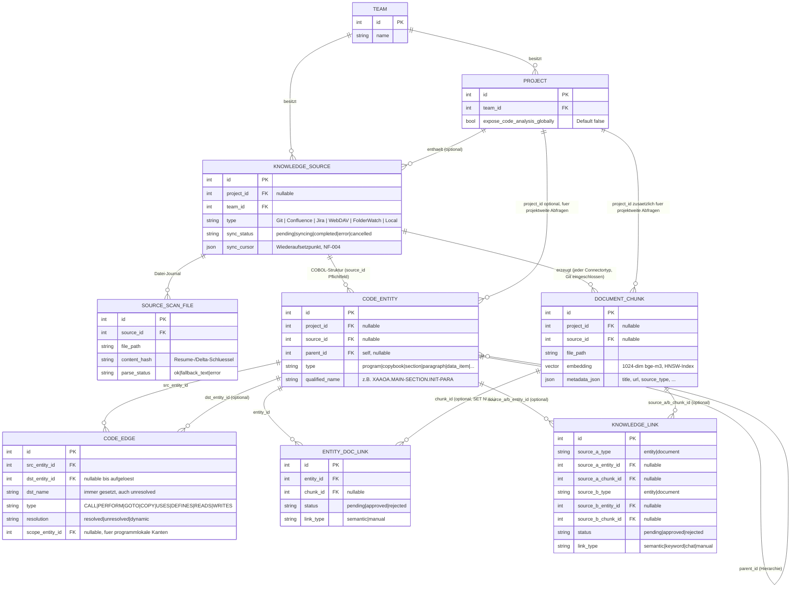
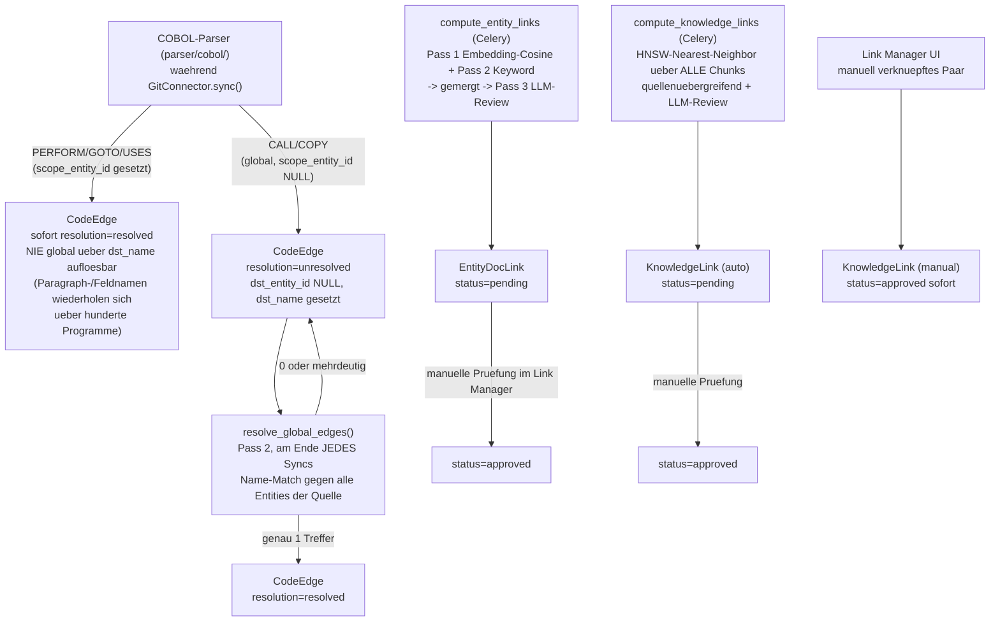

# Datenbank & Graph-Bildung

Zwei Fragen in einem Dokument, weil sie zusammenhängen: was in PostgreSQL
liegt (`backend/models/database.py`/`parser/models/database.py` — byte-
identisch, siehe CLAUDE.md), und wie aus diesen Zeilen zur Laufzeit **drei
verschiedene** Graphen entstehen, die unterschiedlichen Zwecken dienen.

## Tabellenübersicht

Nicht jede Tabelle ist graph-relevant. Diese hier schon:

**Warum `CodeEdge.dst_entity_id` nullable ist:** beim inkrementellen Sync wird
Programm A vor Programm B geparst — ein `CALL 'B'` aus A entsteht zunächst
mit gesetztem `dst_name = "B"`, aber `dst_entity_id = NULL` (Ziel existiert
noch nicht). `dst_name` bleibt deshalb *immer* gesetzt, auch nach Auflösung —
das macht die Monorepo-Ingestion wiederaufsetzbar, ohne bereits geparste
Dateien erneut anzufassen (NF-004).

**`DocumentChunk.project_id`/`.source_id` sind laut Schema beide nullable**
(historisch für einen Fall gedacht, in dem Git-Chunks nur `project_id` ohne
zugehörige `KnowledgeSource` trugen — dieser Pfad existiert nicht mehr, siehe
`chunk_reindex.py`s inzwischen veralteten Kommentar zu einem entfernten
`tasks/repository.py`). **In der aktuellen Codebasis setzen alle drei
Erzeuger** (`connectors/base.py`, `connectors/git.py`, `tasks/document.py`)
**beide Felder immer** — gegen die laufende DB verifiziert (jeder
`document_chunks`-Datensatz einer Git-Quelle trägt ihren `source_id`).

**Warum `EntityDocLink.chunk_id` `ON DELETE SET NULL` statt `CASCADE` ist:**
ein re-indexierter Dokument-Chunk (Confluence-Seite geändert, Git-Datei neu
geparst) bekommt eine neue `DocumentChunk`-Zeile. `chunk_reindex.py` versucht
per Content-Fingerprint, einen bereits **approved** Link auf die neue
Chunk-Zeile umzuhängen, statt ihn zu verwaisen — nur wenn die Passage
inhaltlich unverändert blieb (siehe `docs/GIT_SYNC_PIPELINE.md`/
`docs/CONFLUENCE_SYNC_PIPELINE.md`).

### Restliche Tabellen (nicht graph-bildend)

| Tabelle | Zweck |
|---|---|
| `users`, `team_memberships`, `project_memberships`, `project_access_requests` | Zugriffsmodell: Team- und Projekt-Mitgliedschaft steuern, was ein Nutzer überhaupt sieht (siehe Abschnitt „Sichtbarkeit" unten) |
| `chat_sessions`, `chat_messages` | Chat-Verlauf inkl. Workspace-Snapshot (`snapshot_json`) für „Sitzung wiederherstellen" |
| `mcp_tool_audit_logs` | Datenminimales Audit-Log für Tool-Aufrufe (Confluence/Jira-MCP), bewusst ohne Tool-Ergebnisse |
| `link_builder_runs`, `diagnostics_runs` | Sichtbare Job-Historie für Celery-Hintergrundläufe (Link-Berechnung, Diagnose-Bundle) — verhindert, dass ein Absturz nur im Log verschwindet |
| `job_center_dismissals` | Admin hat eine abgeschlossene Job-Zeile im Job Center weggeklickt, ohne den fachlichen Datensatz zu löschen |
| `topics`, `topic_nodes` | Freies Kuratieren: Nutzer bündeln beliebige Knoten (Entity/Dokument/Projekt/Repo) unter einem Thema — unabhängig von den automatisch berechneten Links |

## Sichtbarkeit — wer sieht was

Bevor irgendetwas zu einem Graph wird, filtert `backend/core/projects.py`
grob in zwei Stufen:

1. **Team-/Projektmitgliedschaft** entscheidet grundsätzlich, welche Projekte
   und Wissensquellen ein Nutzer überhaupt sehen darf.
2. **`Project.expose_code_analysis_globally`** (Default `false`) entscheidet
   zusätzlich, ob `CodeEntity`/`CodeEdge` eines Projekts auch **außerhalb**
   seines eigenen Projekt-Kontexts sichtbar sind (Allgemein-Suche,
   Allgemein-Graph-View, ein anderes Projekt). Innerhalb des eigenen
   Projekt-Kontexts (Code-Editor, projektgebundene Panels) ist das ohne
   Belang. Reine Dokument-Quellen (Confluence/Jira/Upload) sind davon
   bewusst nicht betroffen — die bleiben absichtlich projektübergreifend
   durchsuchbar; nur Code-Analyse-Objekte sind Default-Deny.

## Wie Kanten überhaupt entstehen

Drei komplett unabhängige Hintergrundmechanismen füllen die drei
Kanten-Tabellen — keiner davon läuft synchron zu einer Nutzeranfrage:

- **`CodeEdge`** entsteht ausschließlich beim Parsen (`procedure.py`/
  `copybook.py`/`xref.py`) und wird **nie** durch einen Retrieval- oder
  Anzeige-Pfad neu geschrieben. Lokale Kantenarten sind beim Parsen bereits
  vollständig aufgelöst; globale (`CALL`/`COPY`) hängen am Namens-Match aus
  Pass 2 — bei Mehrdeutigkeit (zwei gleich benannte Programme) bleibt die
  Kante bewusst `unresolved`, statt falsch verdrahtet zu werden (E-1/E-2).
- **`EntityDocLink`** verbindet eine `CodeEntity` mit einem `DocumentChunk`
  (Code ↔ Doku). Kein Auto-Approve — nur `status=approved` wird vom Chat-
  Agenten, den Monaco-Tooltips und dem Wissensgraphen genutzt.
- **`KnowledgeLink`** ist die generische Variante (`entity|document` auf
  beiden Seiten) — automatisch für Dokument↔Dokument über Quellgrenzen
  hinweg berechnet, oder manuell für ein beliebiges Knotenpaar aus der
  Graph-UI angelegt (dort sofort `approved`, ohne Review-Schritt).

## Wie daraus ein Graph wird — drei unabhängige Verbraucher

Dieselben Tabellen speisen drei völlig verschiedene Ansichten/Zwecke, die
unterschiedliche Node-/Edge-Mengen ziehen und unterschiedlich kappen:

| | Wissensgraph (`GET /graph`, `/graph/focus`) | Call-Graph (`GET /callgraph/focus`) | RAG-Graph-Erweiterung (`graph_retrieval.expand_chunks_with_graph`) |
|---|---|---|---|
| **Zweck** | Visualisierung: Code ↔ Dokumentation, Dokument ↔ Dokument | Visualisierung: reine Code-Struktur/-Aufrufe | Kein sichtbarer Graph — reichert den Chat-Kontext eines Vektor-Treffers an |
| **Knoten** | `CodeEntity` + `DocumentChunk` (dedupliziert je `file_path`/Titel) | `CodeEntity` (BFS über `hops` Hops ab einer Wurzel-Entity) | `CodeEntity`, ermittelt über Datei+Zeilen-Überlappung mit dem Vektor-Treffer |
| **Kanten** | `EntityDocLink` + `KnowledgeLink`, nur `status=approved` (Default) | `CodeEdge` mit `type ∈ {CALL, PERFORM, GOTO, COPY}` + **synthetische** `CONTAINS`-Kante aus `CodeEntity.parent_id` (nur Vorfahren nachgezogen, nie Kinder — sonst würde ein Paragraph-Fokus den Knotendeckel mit Datenfeldern sprengen) | `CodeEdge` mit `type ∈ {COPY, CALL}` ab den getroffenen Entities |
| **Deckel** | `KNOWLEDGE_GRAPH_OVERVIEW_MAX_NODES` (Default 2000) — bei Überschreitung bleiben die Knoten mit dem höchsten Grad (meiste Kanten) erhalten (O-053); `/graph/focus` umgeht den Deckel für einen gezielten 1-Hop-Ausschnitt | 500 Knoten hart (`MAX_NODES`), BFS bricht ab, sobald erreicht | Zeichenbudget (`token_budget * 4`, Default 1800 Token) statt Knotenzahl — Nachbar-Chunks werden aufgenommen, bis das Budget aufgebraucht ist |
| **Sichtbarkeit** | Team/Projekt + `expose_code_analysis_globally`-Gate pro Knoten/Kante | `_assert_entity_visible` auf die Wurzel-Entity (Nachbarn werden nicht einzeln nachgeprüft — bewusst, da BFS sonst pro Hop einen weiteren DB-Join bräuchte) | Kein eigener Sichtbarkeits-Check — läuft serverseitig innerhalb einer bereits autorisierten Chat-Anfrage |
| **Export** | CSV, GraphML, Cypher (Neo4j) — `/graph/export`, `/graph/export/neo4j` | JSON, CSV, GraphML — `/callgraph/export` | Kein Export (interner Zwischenschritt) |

Die RAG-Graph-Erweiterung ist der am wenigsten offensichtliche der drei: sie
zeigt dem Nutzer nichts direkt an, sondern sorgt dafür, dass eine Chat-Antwort
über einen Vektor-Treffer hinaus auch die **Definition** eines per `COPY`
eingebundenen Copybooks oder eines `CALL`-Aufrufers/-Aufgerufenen mit in den
LLM-Kontext bekommt — reine Vektorähnlichkeit würde solche strukturellen
Nachbarn sonst verpassen, wenn ihr Text nicht zufällig auch semantisch nah
am Suchtext liegt.

Quelle: `backend/models/database.py`, `backend/api/graph.py`,
`backend/api/callgraph.py`, `backend/services/graph_retrieval.py`,
`backend/core/projects.py`, `parser/tasks/edge_resolver.py`,
`parser/tasks/link_builder.py`, `parser/tasks/cross_link_builder.py`,
`parser/chunk_reindex.py`.
