# Git-Sync-Pipeline (`GitConnector`)

Ablauf von `GitConnector.sync()` (`parser/connectors/git.py`) — insbesondere,
was pro Datei zwischen den beiden Sync-Log-Zeilen "Embedding gestartet für
'X'." und "'X' indexiert (N Chunks)." (O-072) tatsächlich passiert: das ist
nicht nur Embedding, sondern Strukturanalyse + Chunking + Embedding +
DB-Persistenz in einem Zug.

```mermaid
flowchart TD
    Start(["sync gestartet"]) --> Model["Embedding-Modell sicherstellen<br/>ensure_model_pulled"]
    Model --> GpuCheck{"is_gpu_accelerated?<br/>Warmup-Embed + GET /api/ps"}
    GpuCheck -->|GPU| ConcHigh["Nebenläufigkeit = EMBED_CONCURRENCY<br/>Default 20"]
    GpuCheck -->|CPU-only| ConcLow["Nebenläufigkeit = EMBED_CONCURRENCY_CPU_ONLY<br/>Default 2 (O-071)"]

    ConcHigh --> Fetch
    ConcLow --> Fetch["fetch_documents:<br/>Git-Diff seit sync_cursor lesen"]

    Fetch --> BinCheck{"Bekannte Binärendung?<br/>_SKIPPED_BINARY_EXTENSIONS"}
    BinCheck -->|ja| SkipBin["[SKIP] Binärformat<br/>kein SourceScanFile-Eintrag"]
    BinCheck -->|nein| TextCheck{"_looks_like_text?<br/>striktes UTF-8-Decode +<br/>max. 5% Steuerzeichen (O-074)"}
    TextCheck -->|nein, z.B. EBCDIC| SkipText["[SKIP] kein UTF-8-Text<br/>kein SourceScanFile-Eintrag"]
    TextCheck -->|ja| Yield["Document einreihen"]

    Yield --> Sem{{"Semaphore<br/>(Nebenläufigkeit von oben)"}}

    subgraph perFile ["pro Datei -- _embed_document (O-072-Logzeilen umrahmen diesen Block)"]
        direction TB
        LogStart["_log: Embedding gestartet fuer X."] --> LangCheck{"Sprache COBOL/Copybook?"}
        LangCheck -->|ja| CobolParse["COBOL-Strukturanalyse<br/>parse_program / parse_copybook<br/>-&gt; Entities, Kanten, Chunks"]
        LangCheck -->|nein| GenericChunk["CodeParser.chunk_file<br/>generisches Zeilenchunking"]
        CobolParse --> Embed
        GenericChunk --> Embed["get_embeddings_batch<br/>HTTP -&gt; Ollama /api/embed"]
        Embed -->|Fehler| EmbedErr["_log: Embedding-Fehler<br/>Chunks bleiben ohne Embedding<br/>-&gt; Einzel-Chunk-Fallback spaeter"]
        Embed --> Return["Doc + Chunks + ParseResult"]
        EmbedErr --> Return
    end

    Sem --> LogStart
    Return --> Persist

    subgraph persistBlock ["_save_document_chunks (DB, sequentiell)"]
        direction TB
        Persist["reindex_chunks_preserving_links<br/>DocumentChunk schreiben<br/>(Fallback: fehlende Embeddings einzeln nachholen)"]
        Persist --> PersistParse["persist_parse_result<br/>CodeEntity/CodeEdge schreiben<br/>(nur bei COBOL-Ergebnis)"]
        PersistParse --> ScanFile["SourceScanFile upserten<br/>content_hash, parse_status"]
    end

    ScanFile --> LogDone["_log: X indexiert (N Chunks)."]
    LogDone --> Progress["parsed_files/progress aktualisieren<br/>(O-075: erst hier, nicht beim Einreihen)"]
    Progress --> More{"Weitere Dateien?"}
    More -->|ja| Sem
    More -->|nein| Resolve["Pass 2: globale CALL/COPY-Kanten<br/>ueber den ganzen Sync-Lauf aufloesen"]
    Resolve --> Done(["sync abgeschlossen"])
```

## Kernpunkte

- **Die Semaphore** (oben per `is_gpu_accelerated()` bestimmt, O-071) begrenzt,
  wie viele Dateien gleichzeitig den `perFile`-Block durchlaufen — nicht nur
  das Embedding, sondern Parsen+Chunking+Embedding zusammen laufen pro Slot
  seriell.
- **"Embedding gestartet"** (O-072) markiert den Moment, in dem eine Datei den
  Semaphore-Slot bekommt — nicht den Start des eigentlichen Ollama-Requests.
  Die gemessene Zeit bis "indexiert" umfasst COBOL-Strukturanalyse, Chunking,
  Embedding **und** die anschließende DB-Persistenz (Chunks + Entities/Kanten).
- **Binär-/EBCDIC-Skips** (O-074) passieren schon in `fetch_documents()`, vor
  der Semaphore — sie kosten praktisch keine Zeit und keinen Ollama-Aufruf.
- **`persistBlock`** läuft sequentiell im `sync()`-Abschluss-Loop (nicht unter
  der Semaphore) — DB-Schreibzugriffe auf dieselbe `KnowledgeSource`-Zeile
  bleiben dadurch unkritisch bezüglich Nebenläufigkeit.

Quelle: `parser/connectors/git.py` (`sync`, `fetch_documents`,
`_embed_document`, `_save_document_chunks`, `_looks_like_text`),
`parser/ollama_client.py` (`is_gpu_accelerated`). Siehe
`docs/OFFENE_ENTWICKLUNGSPUNKTE.md` O-071/O-072/O-074/O-075 für die
Entstehungsgeschichte der einzelnen Bausteine.
