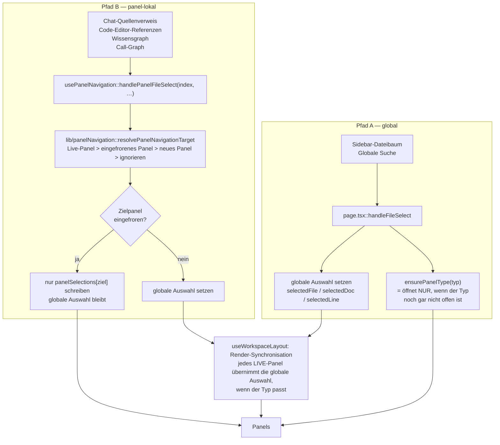

# Doctwos — Panel-Synchronisation (Soll-Matrix)

**Stand:** 06.09.2026
**Anlass:** [O-092](OFFENE_ENTWICKLUNGSPUNKTE.md) — „Eine Aktion in einer Ansicht wird
nicht in jeder Konstellation korrekt in die anderen Ansichten synchronisiert; das
Verhalten wirkt fallabhängig."

**Zweck:** Festlegen, welches Panel auf welche Aktion reagieren *soll* — bevor das
Verhalten in Tests zementiert wird. Ohne diese Festlegung testet man den
Ist-Zustand statt der Absicht. Jede Zeile der Matrix hat eine ID (`PS-nn`), auf die
sich die Regressionstests in `frontend/hooks/panelSyncMatrix.test.tsx` beziehen.

---

## 1. Die zwei Navigationspfade

Der wichtigste Befund dieser Analyse: es gibt **nicht einen** Navigationsweg, sondern
zwei, mit unterschiedlichen Regeln. Dieselbe Nutzerabsicht („diese Datei öffnen")
läuft je nach Klickort durch den einen oder den anderen — das erklärt den Eindruck,
das Verhalten sei fallabhängig.



Die Synchronisationsregel selbst (`useWorkspaceLayout.ts`, Render-Block
„Synchronize live panels during render") lautet im Ist-Zustand:

> Ein Panel übernimmt die globale Auswahl, wenn es **nicht eingefroren** ist **und**
> (sein Typ `chat`, `graph` oder `callgraph` ist **oder** die Auswahl leer ist
> **oder** der Auswahltyp genau seinem Panel-Typ entspricht).

Daraus folgt unmittelbar: `linkmanager`- und `webview`-Panels stehen außerhalb der
Always-Sync-Liste, eingefrorene Panels immer außerhalb.

---

## 2. Die Dimensionen — und warum der Layoutmodus keine ist

Ursprünglich war die Matrix als **Auslöser-Ansicht × Aktion × Layoutmodus** geplant.
Der Layoutmodus fällt bei der Prüfung als eigene Dimension weg:

```ts
// useWorkspaceLayout.ts:597
layoutMode: panelConfigs.length === 1 ? '1-pane'
          : panelConfigs.length === 2 ? 'split'
          : panelConfigs.length === 3 ? '3-col' : '4-grid'
```

Der Layoutmodus ist **kein Eingabewert, sondern eine Anzeige der Panel-Anzahl**. Er
beeinflusst die Navigation an genau einer Stelle: bei vier Panels greift die Obergrenze
(`addPanel`-Guard und `maxPanels = 4` in `resolvePanelNavigationTarget`), ein fünftes
Panel entsteht nicht. `1-pane`, `split` und `3-col` verhalten sich navigationsseitig
identisch.

Die tatsächlich wirksamen Dimensionen sind deshalb:

| Dimension | Ausprägungen |
|---|---|
| **Pfad** | A (global) · B (panel-lokal), B zusätzlich mit `openIfMissing` und `preserveFrozenTarget` |
| **Aktion** | Code öffnen · Dokument öffnen · Web-Origin öffnen · Objekt fokussieren · Zeile pinnen · Einfrieren/Auftauen · Historie · Panel-Typwechsel |
| **Zielpanel-Zustand** | live vorhanden · nur eingefroren vorhanden · nicht vorhanden (&lt; 4 Panels) · nicht vorhanden (4 Panels = `4-grid`) |

Das reduziert die geplanten 7 × 5 × 4 = 140 Zellen auf die 30 unten, ohne etwas
auszulassen.

---

## 3. Auslöser-Inventar

Welcher Auslöser welchen Pfad mit welchen Parametern benutzt — geprüft am Code:

| Auslöser | Steuerelement | Pfad | Parameter | Fundstelle |
|---|---|---|---|---|
| Sidebar | Dateibaum, Quellenliste | A | — | `app/page.tsx::handleSidebarFileSelect` |
| Globale Suche | Ergebnis „Datei"/„Dokument" | A | — | `app/page.tsx` (Suchergebnis-Handler) |
| Globale Suche | Ergebnis „Objekt" | A | über `handleEntitySelect` | `hooks/usePanelNavigation.ts` |
| Chat | Quellenverweis in der Antwort | B | `openIfMissing=true` | `PanelContentRenderer.tsx` (ChatView-Zweig) |
| Code-Editor | Referenzen-Dropdown, Copybook-Sprung | B | `openIfMissing=true` | `SplitPaneWorkspace.tsx` |
| Code-Editor | Dokument-Treffer im Referenz-Dropdown | B + `onDocFocus` | — | `SplitPaneWorkspace.tsx:1060` |
| Code-Editor | Gutter-Klick / „Objekt fragen" | Chat-Pin | `ensurePanelType('chat')` | `usePanelNavigation::handleGutterClick` |
| Wissensgraph | „In passender Ansicht öffnen" (Objekt) | B | `openIfMissing=true` + `onEntitySelect` | `KnowledgeGraphView.tsx:860` |
| Wissensgraph | „In passender Ansicht öffnen" (Dokument) | B | `openIfMissing=true` + `onDocFocus` | `KnowledgeGraphView.tsx:877` |
| Wissensgraph | Einfachklick auf einen Knoten | B | `openIfMissing=false` | `KnowledgeGraphView.tsx:1199` |
| Call-Graph | Knoten anklicken | B | `preserveFrozenTarget=true` | `PanelContentRenderer.tsx` (callgraph-Zweig) |
| Link-Manager | — | **keiner** | — | `PanelContentRenderer.tsx` (linkmanager-Zweig) |
| Panel-Kopf | Typ wechseln, Historie, Einfrieren, Schließen | eigene | — | `PanelRenderer.tsx` / `useWorkspaceLayout.ts` |

---

## 4. Die Matrix

**Status-Legende:** ✅ Ist = Soll (durch Test festzuhalten) · ⚠️ Ist ≠ Soll (Fehler,
eigener O-Punkt) · ❓ noch nicht entschieden (siehe Abschnitt 5)

### 4.1 Code-Datei öffnen

| ID | Pfad | Zielpanel-Zustand | Ist-Verhalten | Soll | Status |
|---|---|---|---|---|---|
| PS-01 | A | `code` live vorhanden | Globale Auswahl gesetzt, Live-Panel übernimmt sie beim nächsten Render | wie Ist | ✅ |
| PS-02 | A | kein `code`-Panel, < 4 Panels | `ensurePanelType('code')` öffnet ein Panel; es startet mit der *vorherigen* globalen Auswahl und korrigiert sich im selben Renderdurchlauf über die Sync-Regel | wie Ist (Selbstkorrektur ist Absicht, nicht Zufall — deshalb testen) | ✅ |
| PS-03 | A | nur ein **eingefrorenes** `code`-Panel | `ensurePanelType` hält den Typ für vorhanden → kein neues Panel; das eingefrorene Panel synchronisiert nicht → **sichtbar passiert nichts, ohne jede Rückmeldung** | Neues Live-Panel öffnen (< 4) bzw. Hinweis | ⚠️ [D-1] |
| PS-04 | A | 4 Panels offen, kein `code` | `addPanel` bricht an der Obergrenze stumm ab; globale Auswahl ändert sich trotzdem | Hinweis statt stiller Wirkungslosigkeit | ⚠️ [D-2] |
| PS-05 | B | Ziel live vorhanden, Auslöser ist ein anderes Panel | Auswahl ins Live-Zielpanel **und** in die globale Auswahl | wie Ist | ✅ |
| PS-06 | B | Ziel = Auslöserpanel selbst, live | Bleibt im eigenen Panel, globale Auswahl folgt | wie Ist | ✅ |
| PS-07 | B | Ziel = Auslöserpanel selbst, **eingefroren** | Schreibt in das eingefrorene Panel, globale Auswahl bleibt unberührt, Panel-Historie wächst | wie Ist: Einfrieren schützt vor *fremder* Navigation, nicht vor Navigation im Panel selbst | ✅ (festgelegt) |
| PS-08 | B | nur ein **eingefrorenes** Zielpanel, `preserveFrozenTarget=false` | Fällt auf das eingefrorene Panel zurück und **überschreibt dessen Auswahl** | Einfrieren schützt; neues Live-Panel bzw. Hinweis | ⚠️ [D-1] |
| PS-09 | B | nur ein eingefrorenes Zielpanel, `preserveFrozenTarget=true` (Call-Graph) | Kein Rückfall; neues Panel (< 4) bzw. wirkungslos | wie Ist | ✅ |
| PS-10 | B | Ziel fehlt, `openIfMissing=true`, < 4 Panels | Neues Live-Panel mit der Auswahl | wie Ist | ✅ |
| PS-11 | B | Ziel fehlt, `openIfMissing=false` (Graph-Einfachklick) | Nichts passiert | wie Ist („nur anstupsen") | ✅ |
| PS-12 | B | Ziel fehlt, `openIfMissing=true`, 4 Panels | Stumm ignoriert | Hinweis | ⚠️ [D-2] |

### 4.2 Dokument und Web-Origin öffnen

| ID | Pfad | Konstellation | Ist-Verhalten | Soll | Status |
|---|---|---|---|---|---|
| PS-13 | B | Pfad mit Dokumentendung (`.pdf/.docx/.md/.png/.jpg`) + Quelle | `doc`-Panel | wie Ist | ✅ |
| PS-14 | B | Quelle vom Typ Confluence/Jira | `webview`-Panel, unabhängig von der Endung | wie Ist | ✅ |
| PS-15 | B + `onDocFocus` | Wissensgraph, **Dokument-Knoten mit Code-Endung** (z. B. `.cbl`), Aktion „In passender Ansicht öffnen" | **Zwei Panels:** `onFileSelect` bestimmt anhand der Endung `code` und öffnet einen Editor, `onDocFocus` öffnet zusätzlich unbedingt ein `doc`-Panel und setzt die globale Doc-Auswahl — die den frisch geöffneten Code-Editor über die Sync-Regel wieder **leert** | Ein Klick = eine Ansicht: Zieltyp genau einmal bestimmen | ⚠️ = [O-091] |
| PS-16 | B + `onDocFocus` | dieselbe Konstellation, aber Einfachklick (`openIfMissing=false`) | Kein zusätzliches Panel, aber derselbe doppelte Schreibvorgang, sobald ein `doc`-Panel offen ist | wie PS-15 | ⚠️ = [O-091] |

### 4.3 Objekt fokussieren

| ID | Auslöser | Ist-Verhalten | Soll | Status |
|---|---|---|---|---|
| PS-17 | Wissensgraph, Objektknoten | `onFileSelect` öffnet/aktualisiert das Code-Panel; `onEntitySelect` schreibt die Entity **panel-lokal in das Graph-Panel** und (nur wenn das Graph-Panel live ist) global. Da „Graph öffnen" das Panel eingefroren anlegt, ist der Normalfall: nur lokal | wie Ist — der Code-Editor löst seine Entity ohnehin selbst über `api.resolveEntity` auf | ✅ |
| PS-18 | Code-Editor, Objekt im Kontextmenü | Panel-lokale Entity, global nur wenn das Panel live ist | wie Ist | ✅ |
| PS-19 | Globale Suche, Objekt-Treffer | `handleEntitySelect`: globale Entity + Referenzen laden + Pfad A | wie Ist | ✅ |

### 4.4 Zeile in den Chat pinnen

| ID | Konstellation | Ist-Verhalten | Soll | Status |
|---|---|---|---|---|
| PS-20 | Gutter-Klick, Chat-Panel offen (live **oder** eingefroren) | `pinnedCode` ist globaler Zustand und erreicht das Chat-Panel unabhängig vom Einfrieren | wie Ist: Einfrieren betrifft die *Auswahl*, nicht den Chat-Pin | ✅ (festgelegt) |
| PS-21 | Gutter-Klick, kein Chat-Panel, 4 Panels offen | Pin wird gesetzt, `ensurePanelType('chat')` bleibt wirkungslos → der Nutzer sieht seinen Pin nirgends | Hinweis | ⚠️ [D-2] |

### 4.5 Einfrieren, Historie, Panel-Verwaltung

| ID | Aktion | Ist-Verhalten | Soll | Status |
|---|---|---|---|---|
| PS-22 | Panel einfrieren | Panel behält seine Auswahl und folgt der globalen nicht mehr | wie Ist | ✅ |
| PS-23 | Panel auftauen | Panel übernimmt die globale Auswahl **samt Zeile**. `togglePanelFreeze` setzt `selectedLine` zwar hart auf `null`, die unmittelbar folgende Render-Synchronisation schreibt die globale Zeile aber zurück — das `null` ist redundant, nicht schädlich (beim Schreiben der Tests nachgewiesen; zuerst als Fehler notiert) | wie Ist | ✅ |
| PS-24 | „Wissensgraph öffnen" aus dem Menü | Legt das Graph-Panel **eingefroren** an bzw. friert ein bestehendes ein und leert dessen Auswahl | wie Ist (bewusst: der Graph soll nicht bei jedem Klick woanders hinspringen) | ✅ |
| PS-25 | Historie zurück/vor (Alt+←/→) in einem **Live**-Panel | Setzt die Panel-Auswahl **und** die globale Auswahl → alle anderen Live-Panels ziehen nach | wie Ist | ❓ [D-4] |
| PS-26 | Historie in einem **eingefrorenen** Panel | Bleibt lokal | wie Ist | ✅ |
| PS-27 | Panel-Typ im Kopf wechseln | Auswahl des Panels bleibt, Fokus-Objekt und Panel-Historie werden geleert; ein Live-Panel zieht sich anschließend über die Sync-Regel die passende globale Auswahl | wie Ist | ✅ |
| PS-28 | Panel schließen | Slot samt Auswahl/Historie entfernt, globale Auswahl bleibt bestehen | wie Ist | ✅ |

### 4.6 Die Sync-Regel selbst

| ID | Konstellation | Ist-Verhalten | Soll | Status |
|---|---|---|---|---|
| PS-29 | Im Chat ein Dokument öffnen, während ein `callgraph`-Panel offen ist | `callgraph` synchronisiert **jede** Auswahl (Always-Sync-Liste); die Dokumentauswahl setzt `selectedEntity` auf `null` → der Call-Graph verliert seinen Fokus | Call-Graph-Fokus bei einer Auswahl ohne Entity behalten | ❓ [D-3] |
| PS-30 | `linkmanager`-Panel offen, Navigation an anderer Stelle | Synchronisiert nie (weder ein- noch ausgehend); der Link-Manager ist eine Insel | vorerst wie Ist | ❓ [D-5] |

---

## 5. Offene Festlegungen

Diese fünf Zellen sind fachliche Entscheidungen, keine Fehler im engeren Sinn. Sie
müssen entschieden sein, bevor die betroffenen Zeilen automatisiert werden — sonst
zementieren die Tests einen Zustand, den niemand beschlossen hat.

| ID | Frage | Betrifft | Vorschlag |
|---|---|---|---|
| **D-1** | Was gilt, wenn das einzige Panel des Zieltyps eingefroren ist? Heute widersprechen sich die Pfade: A tut **nichts** (PS-03), B **überschreibt** das eingefrorene Panel (PS-08). | PS-03, PS-08 | Einfrieren schützt in beiden Pfaden. Zielauflösung: Live-Panel → sonst neues Panel → sonst Hinweis. Das eingefrorene Panel wird nur von einem Klick **in ihm selbst** verändert (PS-07). |
| **D-2** | Was passiert, wenn kein passendes Panel offen ist und die 4-Panel-Grenze erreicht ist? Heute: stiller Abbruch in allen drei Varianten. | PS-04, PS-12, PS-21 | Kurzer Hinweis („Kein Platz für eine weitere Ansicht — bitte ein Panel schließen"). Kein automatisches Umwidmen eines fremden Panels. |
| **D-3** | Soll ein `callgraph`-Panel seinen Fokus verlieren, wenn anderswo ein Dokument geöffnet wird? | PS-29 | Nein — Fokus behalten, wenn die eingehende Auswahl keine Entity enthält. |
| **D-4** | Soll die Historie eines Live-Panels die anderen Live-Panels mitziehen? | PS-25 | Ja (Ist-Zustand), aber bewusst festhalten: „Zurück" ist eine Bewegung der Arbeitssituation, nicht eines einzelnen Fensters. |
| **D-5** | Bleibt der Link-Manager eine Insel? | PS-30 | Vorerst ja; „aus dem Link-Manager in die Code-Ansicht springen" als eigener Punkt, nicht als Teil dieser Aufräumarbeit. |

---

## 6. Stand der Automatisierung

`frontend/hooks/panelSyncMatrix.test.tsx` (27 Fälle) hält die Matrix fest:

- **21 Zeilen** mit ✅ sind als Test abgesichert — Pfad A gegen `useWorkspaceLayout`
  (die Sync-Regel war bis dahin gar nicht getestet), Pfad B gegen
  `usePanelNavigation`.
- **PS-15** steht als `it.fails` drin: der Test formuliert das Soll („ein Klick =
  eine Ansicht") und ist heute erwartbar rot. Sobald [O-091] behoben ist, schlägt er
  an und muss in ein normales `it` gewandelt werden. Damit ist der Fehler
  reproduziert, ohne die Suite rot zu machen.
- **5 `it.todo`** markieren die offenen Entscheidungen D-1 bis D-4. Sie werden
  bewusst nicht ausformuliert, solange das Soll nicht entschieden ist.

Beim Schreiben der Tests hat sich eine Zeile der Matrix als falsch erwiesen: PS-23
(„Auftauen verliert die Zeile") ist kein Fehler — die Render-Synchronisation holt die
Zeile unmittelbar zurück. Die Zeile steht jetzt als ✅ in der Matrix, die zugehörige
Entscheidung D-5 ist entfallen.

---

## 7. Verweise

- [Offene Entwicklungspunkte](OFFENE_ENTWICKLUNGSPUNKTE.md) — O-091 (PS-15/PS-16), O-092 (dieses Dokument)
- `frontend/hooks/panelSyncMatrix.test.tsx` — Regressionstests, nach `PS-nn` benannt
- `frontend/lib/panelNavigation.ts` — Zielauflösung des Pfads B
- `frontend/hooks/useWorkspaceLayout.ts` — Sync-Regel, Einfrieren, Panel-Historie
- `frontend/hooks/usePanelNavigation.ts` — Pfad B
